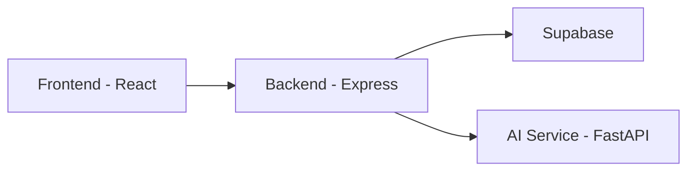

# SplitSmart AI

SplitSmart AI is a full stack expense splitting app with AI assisted categorization and anomaly detection. It pairs a Node and Express API with a React UI, then adds a FastAPI service for ML powered insights.

## Why it is useful

- Track shared expenses across groups with clear splits.
- Categorize expenses automatically with an ML model.
- Flag unusual expenses for quick review.
- Optimize settlements to reduce the number of transfers.

## Architecture



## Tech stack

- Frontend: React, Tailwind CSS, Chart.js
- Backend: Node.js, Express, Supabase
- AI Service: FastAPI, joblib

## Project structure

- Frontend: UI and client side state
- Backend: REST API, auth, expenses, groups, settlements
- ai: ML service, model loading, inference endpoints

## Getting started

### Prerequisites

- Node.js 18+
- Python 3.10+
- A Supabase project

### 1) Backend setup

Create a `.env` file inside `Backend` with the following keys:

```env
PORT=3000
SUPABASE_URL=your_supabase_url
SUPABASE_ANON_KEY=your_supabase_anon_key
SUPABASE_SERVICE_ROLE_KEY=optional_service_role_key
AI_SERVICE_URL=http://localhost:8000
```

Install dependencies and start the API:

```bash
cd Backend
npm install
node server.js
```

### 2) AI service setup

Install dependencies and start the ML service:

```bash
cd ai
pip install -r requirements.txt
uvicorn api.main:app --reload --port 8000
```

Make sure the trained models exist in `ai/models`:

- `expense_categorization_model.joblib`
- `expense_anomaly_model.joblib`

### 3) Frontend setup

Install dependencies:

```bash
cd Frontend
npm install
```

If the frontend scripts are not defined yet, add your preferred dev and build scripts in `Frontend/package.json` before starting the UI.

## Configuration notes

- CORS for the AI service is configured to allow `http://localhost:3000`.
- The backend expects JSON requests and uses Supabase tokens for auth.

## Roadmap ideas

- Add expense receipt OCR.
- Improve anomaly explanations.
- Add group level budgeting and alerts.

## License

Add your license here.
